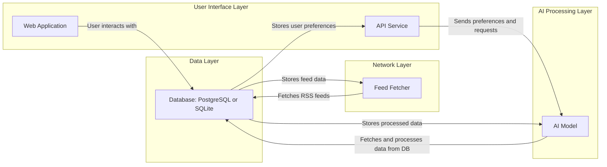

```mermaid
graph LR

subgraph Data Layer
DB[Database: PostgreSQL or SQLite]
end

subgraph Network Layer
FFC[Feed Fetcher]
end

subgraph AI Processing Layer
AIM[AI Model]
end

subgraph User Interface Layer
API[API Service]
UI[Web Application]
end

UI -->|User interacts with| DB
API -->|Sends preferences and requests| AIM
AIM -->|Fetches and processes data from DB| DB
FFC -->|Fetches RSS feeds| DB
DB -->|Stores feed data| FFC
DB -->|Stores user preferences| API
DB -->|Stores processed data| AIM

```
